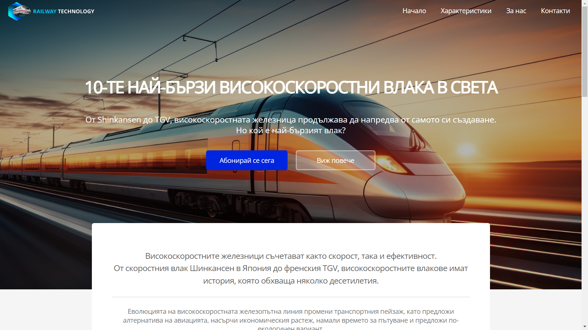
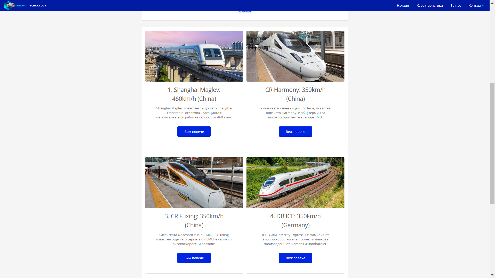
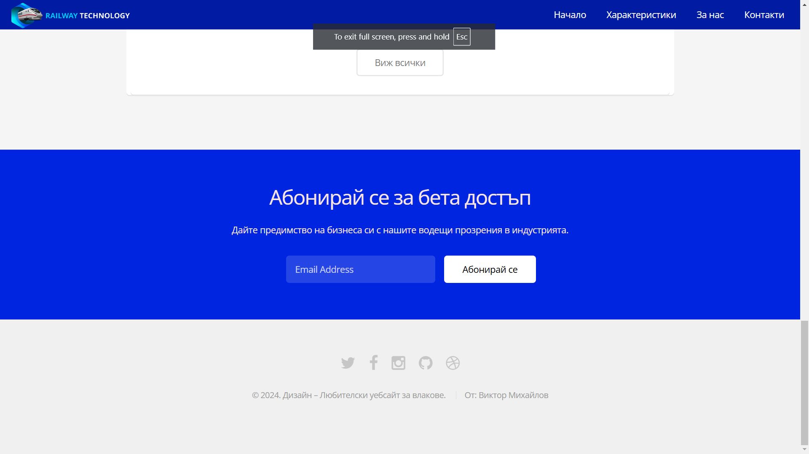
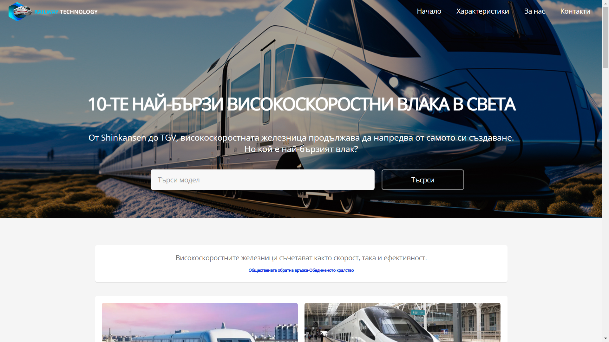
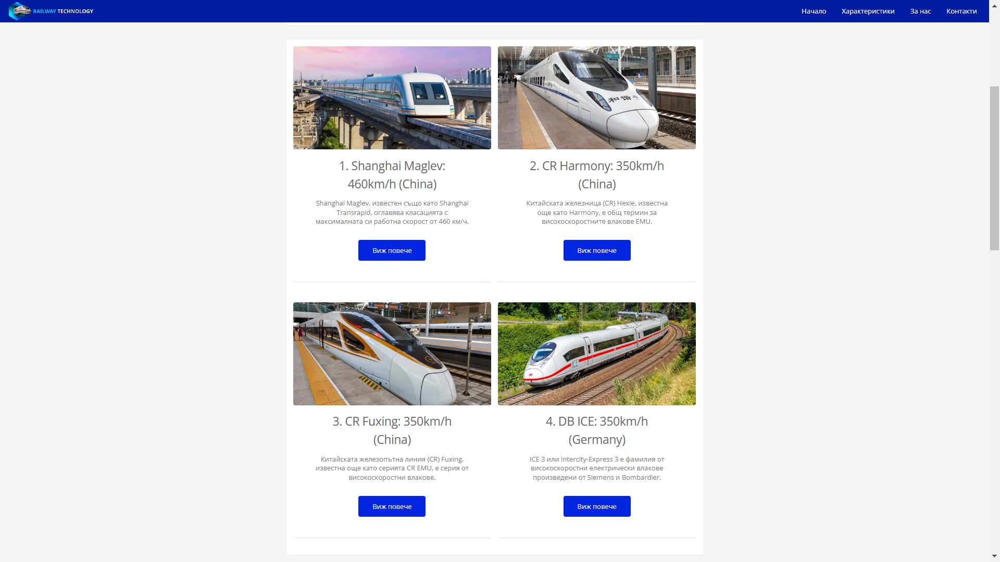
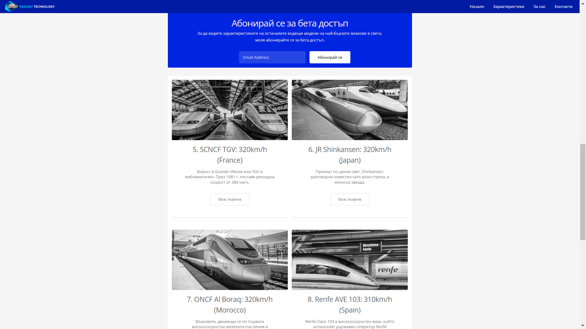
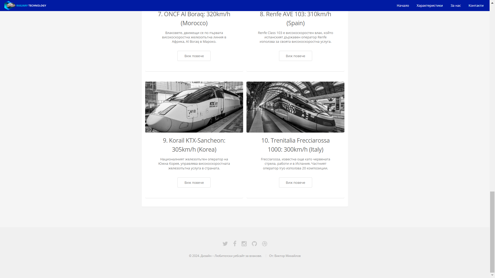
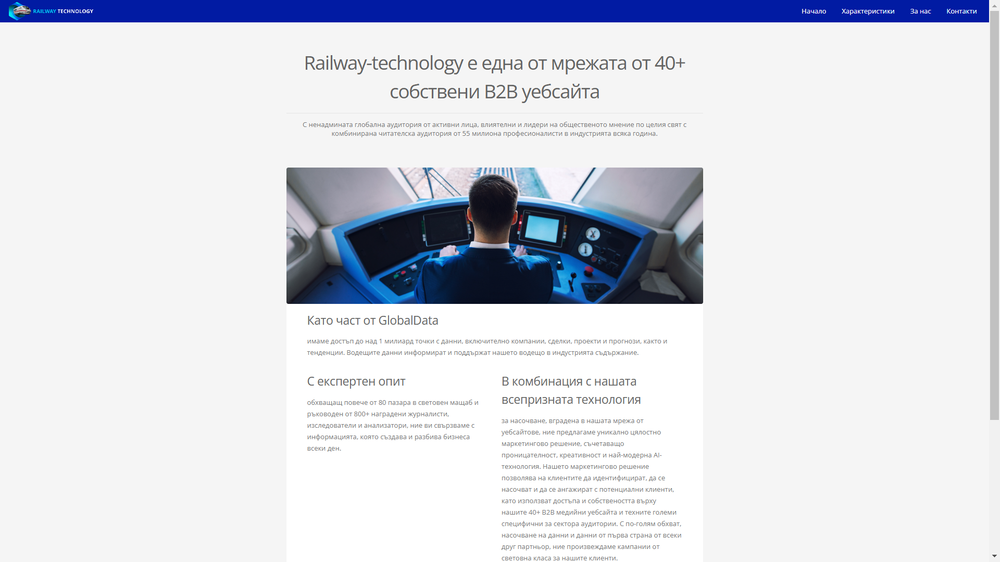
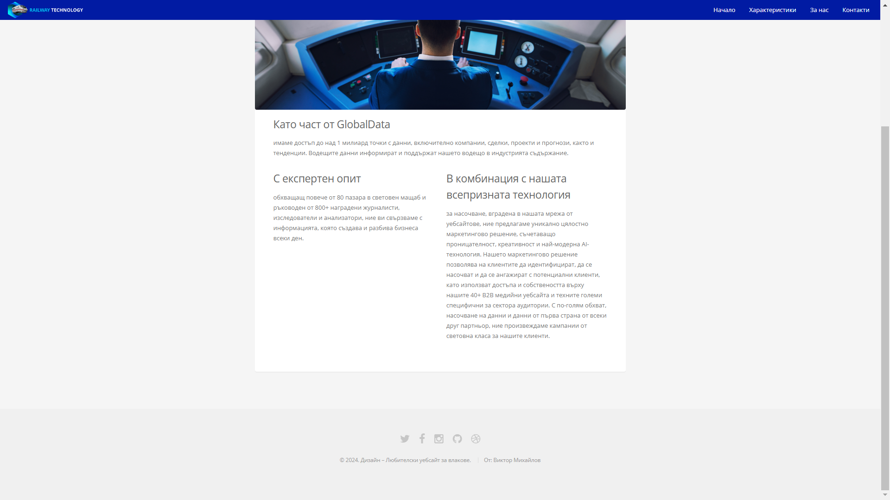
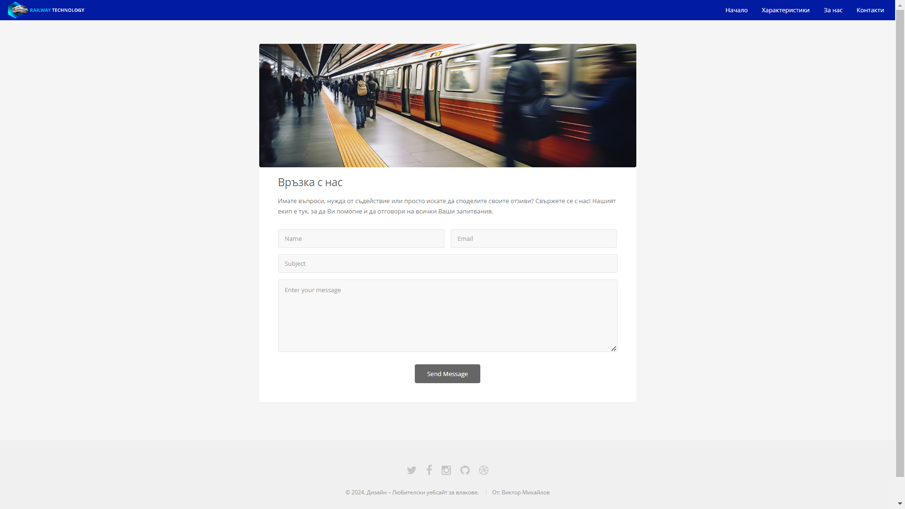

# Railway Technology

Railway Technology е уебсайт, посветен на 10-те най-бързи влака в света. Той предоставя уникална възможност на потребителите да се запознаят с водещите технологии и характеристики на тези високоскоростни машини. Потребителите могат да разглеждат детайли за първите 4 влака безплатно, а за достъп до информация за останалите 6 влака се изисква абонамент.

## Основни функционалности
- **Списък на 10-те най-бързи влака в света** – информация за модел, максимална система, производител, Констукция, Галерия със снимки на конктретния модел влак и др.
- **Подробни описания** – достъп до технически характеристики и история на първите 4 влака.
- **Абонамент за допълнителна информация** – потребителите могат да се абонират, за да получат подробности за останалите 6 влака - Бета достъп.
- **Меню с лесна навигация** – включва:
  - Начална страница
  - Характеристики на влаковете
  - За нас
  - Контакти
  
## Използвани технологии
- **HTML5** – за създаване на структурата и съдържанието на сайта.
- **CSS3** – за оформление и стилизиране на уеб страниците.
- **JavaScript** – за динамични елементи и подобряване на интерактивността.

## Инсталация и стартиране

1. Клонирайте репозиторито:
   ```bash
   https://github.com/ITPG-CODEWARS/codewars-2024-first-round-ViktorMihaylov28

2. Отворете index.html файла

## Структура на сайта
- /index.html – Начална страница на сайта с преглед на всички влакове.
- /css/styles.css – CSS файл за стилизиране на страниците.
- /js/main.js – JavaScript файл за интерактивни функции.
- /images/ – Папка със снимки на влаковете, всички със разрешен лиценз за употреба.

## Лицензиране на снимки и изображения
Всички изображения в сайта са използвани с подходящ лиценз за разрешена употреба и са генерирани или подбрани с помощта на AI, така че да отговарят на стандартите за отворена употреба.

## Автори
Виктор Михайлов Михайлов © -> https://github.com/ViktorMihaylov28

## Снимки

 -> Начална страница_1

 -> Начална страница 50%_2

 -> Начална страница_3

 -> Характеристики_1

 -> Характеристики 50%_2

 -> Характеристики 50%_3

 -> Характеристики 50%_4

 -> За нас 50%_1

 -> За нас 50%_2

 -> Контакти 50%_1